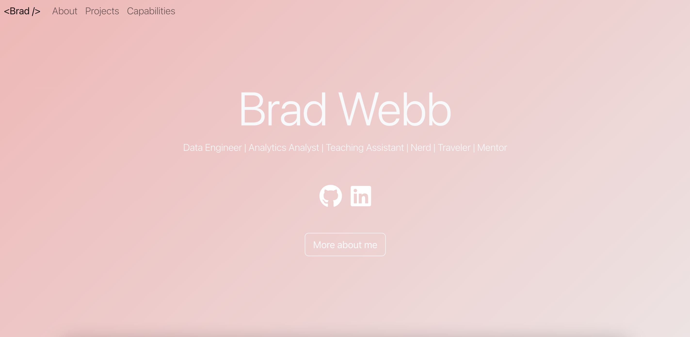
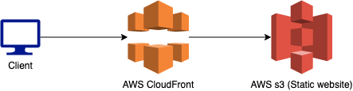

# Personal portfolio Website

This project is my personal project page. The front end is built in React and the Backend a static website with AWS. Infastructure is built with AWS CDK.

## Screenshot



## Project Example

[Website](http://bradwebb101.com)

## How is it built

### Front end

- This project is built with React, I forked this project [hashir shoaeb's github](https://github.com/hashirshoaeb/home). Shout out to Hashir Shoaeb for designing and building the project. I am not a front end developer, so I used his design and modified it for my purpose. 

### Back end

- This site is built as a static website with AWS s3. Distribution is handled by cloudfront. Infastructure built with AWS CDK in Typscript.
  
## Infrastructure



## Downloading and usage

### Front end

You will need to install node to run this app 

https://nodejs.org/en/

To use this repo you need to clone it with git, into your source folder. 

``` git
git clone https://github.com/BradWebb101/portfolio_website_v2.git .
```

Once you have cloned the files into your source folder, use NPM to install the modules

``` cmd 
cd website
npm install 
```

Once NPM has installed the modules, use the NPM run command to mount the app 

``` cmd 
npm run-script start 
```

If you would like to make changes, you will have to rebuild the website. It will update the files in the website/build directory, which is where the files that are uploaded to s3 are stored (See lib/WebsiteStack.ts line 46-50 for the deployment).

```cmd 
npm run-script build
```

### Back end

To run this code you will need a AWS account, AWS CLI and AWS CDK installed. 
- AWS CLI see [Website](https://aws.amazon.com/cli/)
- AWS CDK see [Website](https://aws.amazon.com/cdk/)

If this is your first time building infastrucutre in your AWS account you will need to run the boot strap command. 

```cmd
cdk bootstrap
```

To deploy the infastructure then run, from the root directory.

```cmd
cdk deploy
```